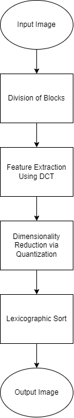

# Image-Forgery-Detection-Using-DCT

## About

This project focuses on detecting a specific form of image forgery known as a copy-move attack, in which a portion of an image is copied and pasted elsewhere.

## Steps to run

1. Clone the repo:
   ```
   git clone https://github.com/Prabhdeep1999/image-forgery-detection
   ```
2. Change directory into root folder:
   ```
   cd image-forgery-detection
   ```
3. Install requirements:
   ```
   pip install -r requirements.txt
   ```
4. Run the cmf_detect.py file:
   ```
   python cmf_detect.py --img images/forged1.png
   ```

## Workflow

<p align="center"></p>

## Sample Result

<p align="center"></p>
